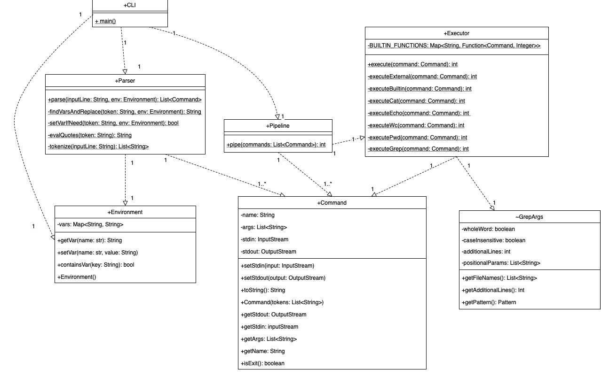
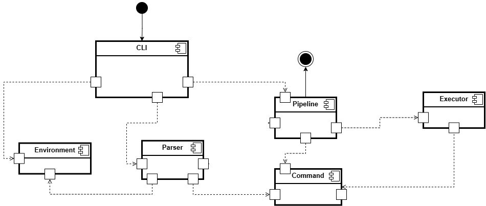

# Архитектура

## Основные компоненты системы
* CLI - основной процесс (main)
* Parser - парсер входной строки (команды)
* Environment - управляет переменными окружения
* Command - способ представления команд
* Pipeline - обрабатывает пайплайны
* Executor - отвечает за исполнение команд

## Используемые классы объектов
* Command:
    * name: str,
    * enum/list: builtin_commands
    * args: List<Str> - список параметров команды
    * stdin, stdout - не являются аргументами, задаются/изменяются отдельно в пайплайне или стандартные
    * constructor, setStdin, setStdout, getArgs, getName, getStdin, getStdout
* Environment:
    * vars: map[str, str]
    * getter, setter, contains(key)
    * Cуществует отдельно созданная в конструкторе переменная "?", отвечающая за код возврата
* GrepArgs: (package private)
    * Класс, предназначенный для парсинга аргументов команды grep. Использует библиотеку JCommand
    * wholeWorld, caseInsensitive: boolean
    * additionalLines: int
    * positionalParams: List<String>. Считается, что pattern всегда идет раньше названия файла
    * getAdditionalLines, getPattern (c учетом wholeWorld, caseInsensitive), getFileNames

## Описание методов остальных классов
* CLI
    1. Создание объекта окружения
    2. Обработка очередной пришедшей строки
        * Вызов parserResult = Parser(string, env)
        * Вызов returnCode = Pipeline(parserResult)
    3. Обновление переменной окружения, отвечающей за код возврата
* Parser. Считается, что входная строка - команда (возможно пайплайн) или подстановка переменной
    1. Разбивает строку на токены, с учетом кавычек (объединяет в один токен)
    2. Определить если это подстановка переменной. Установить env.setVar
        * Проверить соответствует ли токен паттерну ```string=string``` без кавычек
    3. Если команда, выполнить подстановку окружения
        * Пройтись по всем токенам слева направо, найти которые соответствуют паттерну ```.*$string[$"' или конец-строки].*``` и не в двойных кавычках
        * Замена синтаксическая, подстановка одной строки вместо другой
        * Имя переменной определяется жадно, берется все до стоп символа ("'$) или окончания токена
        * Токен - это используемое наименования для обычной строки, просто показывающее, что строка была разделена по определенным правилам
    4. Подстановка/удаление кавычек. Для одинарных ничего делать не надо,
       а все спец символы внутри двойных надо экранировать.
       Удалить сами кавычки, сохранить в виде итоговой, готовой к print строке
    5. разбивает токены на List[List[str]] по "|"
    6. Создание Command как объекта (вызов конструктора от List[str]), для каждого элемента списка с прошлого шага
    7. Возвращает результат работы в формате List[Commands]
        * Результат разбора (parsing) представляется в формате List[Command], где List отвечает последовательности пайплайновых команд.
          Поскольку у нас нет вложенных команд, они хранятся индивидуально, в виде Command, а не AST
* Pipeline
    1. Определяется, является ли переданная цепочка команд пайплайна или индивидуальной
        * Если команда одна (НЕ цепочка с "|"), то просто выполняется единственный вызов команды ```Executor.execute(Command)```
        * В случае если ```Command.isExit()``` программа завершается, без вызова Executor (мы не поддерживаем коды возврата exit, всегда 0)
        * Возвращаемое значение совпадает с ```Executor.execute(Command)```
    2. Случай паплайна.
    3. Для каждой команды определяет поток ввода и вывода, например через PipedInputStream
    4. Создается пулл потоков.
    5. Исполняет каждую команды в отдельном потоке (вызов Executor.execute(Command))
    6. дожидается завершения всех потоков
    7. Возвращаемое значение совпадает с кодом возврата последней выполненной команды
* Executor.execute(Command)
    * isBuiltin - специфичный для каждой программы. Executor выполняет переданную команду
        * Команда exit имеет интерфейс Command, но ее исполнение ничего не делает, только возвращает код 0
    * !isBuiltin - создание нового процесса (ProcessBuilder)
    * Возвращаемое значение - код возврата выполнения команды, соответствует стандартным спецификациям shell
      (0 - успешно, >0 - ошибка)

## Добавление новых команд
Для добавления новой команды надо
* добавить соответствующий обработчик в Executor
* Добавить в map внутри Executor новое значение - имя команды и соответствующий обработчик

## Class diagram



## Component diagram

